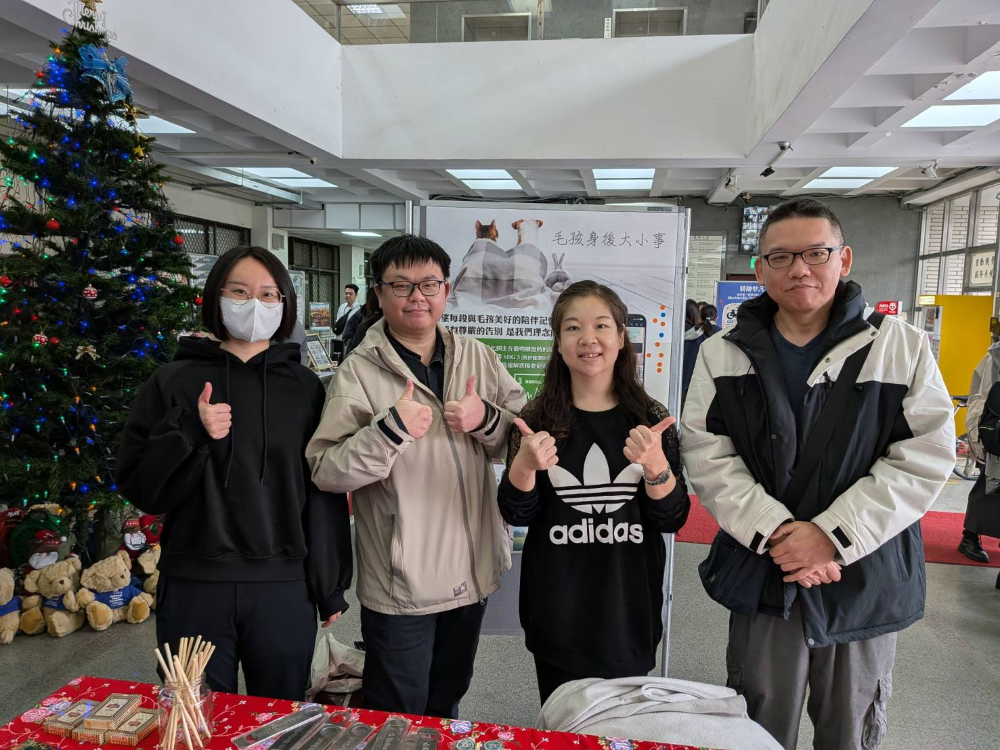

# 為什麼做這個？
[專題發表 PPT](./docs/數位行銷專題.pdf)

本專案為 114年台北大學數位行銷專題 ，旨在解決寵物殯葬資訊匱乏的痛點 。透過 Facebook 社群普及知識 與 Line Bot 聊天機器人提供即時指引 ，整合 AI 評論分析與導航功能 ，在飼主面臨毛孩離世的脆弱時刻，提供清楚且安心的行動支援 。




# 本地測試環境

需求
- [AWS CLI](https://docs.aws.amazon.com/cli/latest/userguide/getting-started-install.html#getting-started-install-instructions)
- [AWS SAM CLi](https://docs.aws.amazon.com/serverless-application-model/latest/developerguide/install-sam-cli.html)
- [ngrok](https://ngrok.com/docs/getting-started)


1. 建立虛擬環境

  - Linux / MacOS
    ```bash
    python -m venv .venv
    source .venv/bin/activate
    pip install -r src/requirements.txt
    ```

  - Windows
    ```PowerShell
    python -m venv .venv
    .venv\Scripts\Activate.ps1
    pip install -r src/requirements.txt
    ```

2. 確認 AWS 設定

```bash
aws sts get-caller-identity
```

  - 修改 AWS Profile (option)

    Linux / MacOS
    ```bash
    export AWS_PROFILE=myprofile
    aws sts get-caller-identity
    ```

  - Windows

    ```PowerShell
    $env:AWS_PROFILE="myprofile"
    aws sts get-caller-identity
    ```

3. 啟動本機 API

```bash
sam build --use-container
sam local start-api --env-vars .env.local.json
```

4. 建立 `ngrok` 轉發

```bash
ngrok http 3000 --host-header=rewrite
```

5. 到測試用 Line Account 設定 webhook
